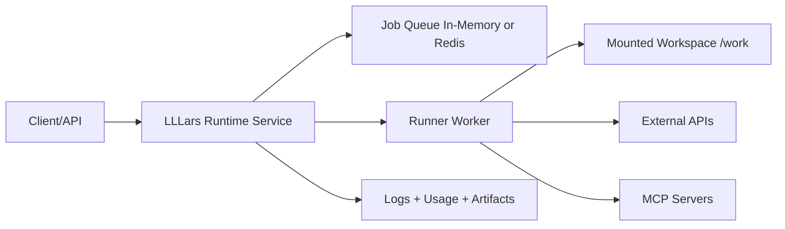

# LLLars Design

## North Star
LLLars reduces chaos in agentic coding by making orchestration explicit, predictable, and operator-controlled.

## Document Status
This document is a design and governance reference, not a substitute for runtime evidence.

When statements here conflict with observed behavior, follow the hierarchy of truth and treat runtime behavior as authoritative.

## Current Baseline
- Runtime controls rely on native PydanticAI capabilities (usage limits, retries, tool timeout, instrumentation).
- Environment-aware execution is explicit (OS, shell, project-root context, allowlisted shell commands).
- MCP support is config-driven with preflight validation.
- Runtime service mode is active with HTTP job lifecycle endpoints and static operator UI.
- Runtime package boundaries are split by concern (`runtime/`, `config/`, `mcp/`, `tools/`) with compatibility removed in favor of canonical package imports.
- Queue backend support is currently productioned for `inmemory`; `redis` remains a scaling-path item.

## Governance and Decision Rules
- Human operator has veto at all times.
- Operator instructions override model habits and assumptions.
- Execution discipline: slow is fast; clarity before edits.
- Truth hierarchy:
  1. Running code and verified runtime behavior.
  2. Repository docs and design docs.
  3. Human discussion and intent framing.
  4. Agent internal reasoning.
  5. Any non-repo memory or cached context (lowest trust).

## Autonomy Boundary (Current)
In scope:
- Operator-guided config adaptation through pre-flight guidance.

Out of scope for now:
- Autonomous code self-modification.
- Unattended widening of safety boundaries.

Guardrail:
- Execution and safety policy changes require explicit human confirmation outside sandbox experiments.

## Runtime Vision
Operate as a runtime service that can run in containers on target systems, operate on mounted volumes, and interact with external APIs/tools under policy constraints.



## Roadmap Phases

### Phase 1: Runtime Contract
- Define JobSpec and RunResult schemas.
- Include prompt, project root, command profile, usage limits, timeout, env allowlist, artifact paths.
- Status: complete.

### Phase 2: Daemon Mode
- Add service mode alongside one-shot CLI.
- Expose minimal operational endpoints: health, submit, status, logs, cancel.
- Status: complete.

### Phase 3: Container Filesystem Model
- Standardize mounts:
  - /work (rw)
  - /config (ro)
  - /artifacts (rw)
- Enforce project-root confinement under /work.
- Status: complete for current runtime deployment assets.

### Phase 4: Execution Hardening
- Move to named command profiles.
- Add env pass-through allowlist.
- Redact secrets in logs/artifacts.
- Support optional no-network mode.
- Status: partial; command profile and policy baseline are active, advanced hardening remains open.

### Phase 5: Packaging and Startup UX
- Runtime image with non-root execution and healthcheck.
- Support run-once and daemon startup.
- Provide practical deployment examples.
- Status: complete for current Docker runtime path.

### Phase 6: Observability and Operability
- Structured per-job logs.
- Persist job artifacts and telemetry timelines.
- Startup preflight summary for endpoint, MCP, and mounts.
- Status: complete for current single-service runtime.

### Phase 7: Scaling Path
- Optional Redis-backed queue.
- Stateless API and worker split.
- Horizontal worker scaling and optional auth.
- Status: planned; not baseline behavior.

## MVP Slice (Shipped)
- Single runtime service container.
- Mounted project volume support.
- HTTP submit/status/cancel.
- Existing guardrails preserved:
  - usage limits
  - retries
  - allowlisted shell commands
  - MCP preflight
- Per-job artifacts for post-mortem analysis.

## Scheduling and Triggering Contract (Current Runtime)
This section documents currently shipped scheduling and triggering behavior.
Submit requests without scheduling fields still execute immediately.

### Lifecycle Terms
- submitted: Request accepted by API or CLI and materialized as `JobSpec`.
- queued: Job registered and waiting for execution.
- running: Job is currently executing.
- terminal: One of `succeeded`, `failed`, or `canceled`.

Scheduling/triggering terms:
- immediate: submit-now flow where no `run_at` or `schedule` is provided.
- timed: one-shot delayed execution at `run_at`.
- scheduled: policy-driven execution described by `schedule`.
- trigger source: origin hint captured as `trigger_source`.

### JobSpec Contract Fields
- `deadline_at` (optional): latest acceptable execution time.
- `run_at` (optional): one-shot planned execution time.
- `schedule` (optional): opaque strategy selector/expression string.
- `trigger_source` (required with default): origin marker; values: `submit`, `scheduled`, `manual`, `api`, `retry`, `external`.

Datetime format policy:
- `deadline_at` and `run_at` are naive ISO datetime strings (`YYYY-MM-DDTHH:MM:SS`).
- Timezone/offset notation is out of scope for this runtime contract and is rejected.

### Strategy-First Direction
- `schedule` is intentionally strategy-oriented, not cron-oriented.
- Current accepted grammar is interval-based: `every:<int><unit>` where unit is one of `s`, `m`, `h`, `d`.
- A cron-style strategy may exist later, but it is not the primary path.
- External signals are first-class scheduling inputs via `trigger_source`.

Example target pattern:
- `schedule = "carbon-aware"`
- `deadline_at = "2026-07-25T23:59:59"`
- `trigger_source = "external"` where an external carbon-awareness signal chooses the actual run window before deadline.

### Contract Invariants
- `run_at` and `schedule` are mutually exclusive.
- If both `run_at` and `deadline_at` are provided, `run_at <= deadline_at`.
- If `schedule` is provided, `trigger_source` must be `scheduled`.
- If `trigger_source` is `scheduled`, at least one of `run_at` or `schedule` must be present.

### Immediate-Submit Compatibility
- Existing submit payloads that only include `prompt`, `run`, `timeout_sec`, and `config_path` remain valid.
- Runtime execution path remains submit-now unless `run_at` or `schedule` is provided.
- Runtime includes explicit trigger routes for queued jobs: `GET /jobs` (queue visibility) and `POST /jobs/{job_id}/trigger` (manual or caller-selected trigger source).
- Trigger route defaults are intentionally minimal: `trigger_source = "manual"`, `trigger_payload_ref = null`.

### Operator Flows (End-to-End)
- Immediate submit:
  - Submit without `run_at` and `schedule`.
  - Job transitions `queued -> running -> terminal`.
- Timed submit:
  - Submit with `run_at`.
  - Job stays `queued` until scheduler promotion at or after `run_at`.
- Recurring submit:
  - Submit with `schedule` and `trigger_source = "scheduled"`.
  - Each cycle runs, then requeues with updated `next_run_at` and incremented `run_count`.
- Manual trigger:
  - Submit a queued job (for example a future `run_at`).
  - Call `POST /jobs/{job_id}/trigger`.
  - Trigger metadata is recorded as manual by default unless explicitly overridden.

### Failure Modes and Recovery
- Validation failure (`422`):
  - Causes: timezone-aware datetimes, invalid schedule grammar, mutually exclusive `run_at` + `schedule`, or invalid scheduled-trigger pairing.
  - Recovery: correct payload and resubmit.
- Invalid trigger state (`409`):
  - Cause: trigger called for non-queued job.
  - Recovery: use `GET /jobs` or `GET /jobs/{job_id}` to confirm queued state, then trigger.
- Unknown job (`404`):
  - Cause: unknown `job_id`.
  - Recovery: resubmit and use returned `job_id`.
- Operator timeout during smoke run:
  - Recovery: inspect `GET /jobs/{job_id}` and `GET /jobs/{job_id}/logs`, then choose trigger (queued jobs) or resubmit.

### Smoke Scenarios
- Immediate: expect terminal `succeeded` with test payload return code `0`.
- Timed: expect queued visibility before terminal completion after due-time promotion.
- Recurring: expect a requeued state with `run_count >= 1` and non-null `next_run_at`.
- Manual trigger: expect queued job to start after `POST /jobs/{job_id}/trigger` and preserve trigger metadata.

## Implementation Framework (Now Active)
- Primary implementation agent: Friday.
- Skills:
  - PydanticAI Framework Expertise
  - FastAPI Expert
  - Modern Python Guru
- Task-oriented implementation workflow is managed through docs/workflow/README.md and task files under docs/workflow/tasks/.

## Tool Extensibility and MCP Capability Design Prep (T38)
This section defines minimal draft contracts for T39 and T40 while preserving current runtime behavior.

### Tool Taxonomy and Execution Boundaries
- `native_files`: built-in local file tools (`list_files`, `read_file`, `write_file`) scoped to `project_root`.
- `native_shell`: built-in policy-gated shell tools (test/eval/allowlisted shell execution).
- `plugin_local`: local repository plugin tools loaded from configured local paths only.
- `mcp_toolsets`: remote MCP-backed tools loaded from configured MCP servers.
- Native groups remain baseline and preserve current safety policies.
- Plugin tools are local-path only; no network marketplace, no dynamic download.
- MCP toolsets remain externally hosted and transport-bound (stdio-first in current implementation).
- Group selection only controls registration; it does not widen filesystem/network policy.

### Tool-Group Config Schema Draft
```json
{"run": {"tool_groups": {"enabled": ["native_files", "native_shell", "plugin_local", "mcp_toolsets"], "disabled": []}}}
```

Draft validation rules for T39:
- Unknown group names are configuration errors.
- Duplicate values within one list are configuration errors.
- If the same group appears in both `enabled` and `disabled`, configuration is rejected (conflict error).
- Omitted `tool_groups` preserves current behavior (fixed native groups plus MCP only when `mcp_enabled=true`).

### MCP Capability Matrix and Fallback Policy Draft
Capability states:
- `healthy`: required server fields are present and connectivity probe succeeds.
- `degraded`: configuration is parseable but one or more capability checks fail.
- `unavailable`: required server launch contract is missing or connectivity cannot be established.

Fallback policy for T40:
- Default policy is degraded-continue.
- If at least one configured MCP server is healthy, runtime continues with healthy capabilities and warns for degraded/unavailable servers.
- If no configured MCP servers are healthy, MCP capability is unavailable and runtime falls back to native/plugin groups only.
- Startup diagnostics must include per-server capability state and operator-facing recovery hints.

## Success Criteria
- Reproducible runs from API payloads.
- Strong filesystem safety boundaries in containerized execution.
- No regression between one-shot and runtime service paths.
- Actionable artifacts/logs for debugging and audit.

## Truth-Driven Maintenance Rule
Any roadmap or baseline statement in this file must be updated when runtime behavior changes and validated.

Validation sources for updates:
- Passing targeted tests and smoke checks.
- Current runtime endpoints/behavior in shipped code.
- Matching entries in planning and changelog docs.
