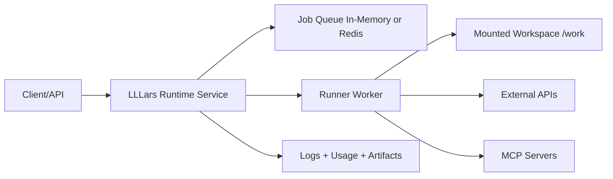

# LLLars Design

## North Star
LLLars reduces chaos in agentic coding by making orchestration explicit, predictable, and operator-controlled.

## Current Baseline
- Runtime controls rely on native PydanticAI capabilities (usage limits, retries, tool timeout, instrumentation).
- Environment-aware execution is explicit (OS, shell, project-root context, allowlisted shell commands).
- MCP support is config-driven with preflight validation.
- Skills and custom-agent workflow are now in place for disciplined implementation.

## Governance and Decision Rules
- Human operator has veto at all times.
- Operator instructions override model habits and assumptions.
- Execution discipline: slow is fast; clarity before edits.
- Truth hierarchy:
  1. Running code and verified runtime behavior.
  2. Repository docs and design docs.
  3. Human discussion and intent framing.
  4. Agent internal reasoning.

## Autonomy Boundary (Current)
In scope:
- Operator-guided config adaptation through pre-flight guidance.

Out of scope for now:
- Autonomous code self-modification.
- Unattended widening of safety boundaries.

Guardrail:
- Execution and safety policy changes require explicit human confirmation outside sandbox experiments.

## Runtime Vision
Wrap the harness into a full runtime service that can run in containers on target systems, operate on mounted volumes, and interact with external APIs/tools under policy constraints.

## Roadmap Phases

### Phase 1: Runtime Contract
- Define JobSpec and RunResult schemas.
- Include prompt, project root, command profile, usage limits, timeout, env allowlist, artifact paths.

### Phase 2: Daemon Mode
- Add service mode alongside one-shot CLI.
- Expose minimal operational endpoints: health, submit, status, logs, cancel.

### Phase 3: Container Filesystem Model
- Standardize mounts:
  - /work (rw)
  - /config (ro)
  - /artifacts (rw)
- Enforce project-root confinement under /work.

### Phase 4: Execution Hardening
- Move to named command profiles.
- Add env pass-through allowlist.
- Redact secrets in logs/artifacts.
- Support optional no-network mode.

### Phase 5: Packaging and Startup UX
- Runtime image with non-root execution and healthcheck.
- Support run-once and daemon startup.
- Provide practical deployment examples.

### Phase 6: Observability and Operability
- Structured per-job logs.
- Persist job artifacts and telemetry timelines.
- Startup preflight summary for endpoint, MCP, and mounts.

### Phase 7: Scaling Path
- Optional Redis-backed queue.
- Stateless API and worker split.
- Horizontal worker scaling and optional auth.

## MVP Slice
- Single runtime service container.
- Mounted project volume support.
- HTTP submit/status/cancel.
- Existing guardrails preserved:
  - usage limits
  - retries
  - allowlisted shell commands
  - MCP preflight
- Per-job artifacts for post-mortem analysis.

## Implementation Framework (Now Active)
- Primary implementation agent: Friday.
- Skills:
  - PydanticAI Framework Expertise
  - FastAPI Expert
  - Modern Python Guru
- Task-oriented implementation backlog and invocation mapping live in docs/IMPLEMENTATION_PREP.md.

## Success Criteria
- Reproducible runs from API payloads.
- Strong filesystem safety boundaries in containerized execution.
- No regression between one-shot and runtime service paths.
- Actionable artifacts/logs for debugging and audit.
