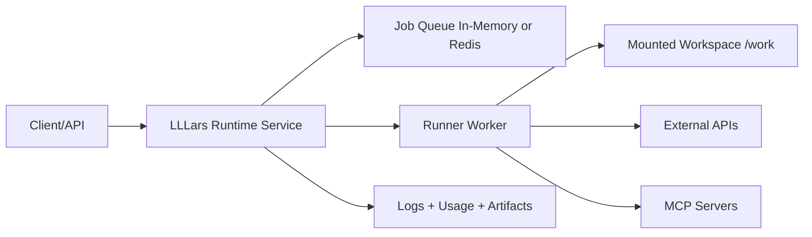

# LLLars Design

## North Star
LLLars reduces chaos in agentic coding by making orchestration explicit, predictable, and operator-controlled.

## Document Status
This document is a design and governance reference, not a substitute for runtime evidence.

When statements here conflict with observed behavior, follow the hierarchy of truth and treat runtime behavior as authoritative.

## Current Baseline
- Runtime controls rely on native PydanticAI capabilities (usage limits, retries, tool timeout, instrumentation).
- Environment-aware execution is explicit (OS, shell, project-root context, allowlisted shell commands).
- MCP support is config-driven with preflight validation.
- Runtime service mode is active with HTTP job lifecycle endpoints and static operator UI.
- Runtime package boundaries are split by concern (`runtime/`, `config/`, `mcp/`, `tools/`) with compatibility removed in favor of canonical package imports.
- Queue backend support is currently productioned for `inmemory`; `redis` remains a scaling-path item.

## Governance and Decision Rules
- Human operator has veto at all times.
- Operator instructions override model habits and assumptions.
- Execution discipline: slow is fast; clarity before edits.
- Truth hierarchy:
  1. Running code and verified runtime behavior.
  2. Repository docs and design docs.
  3. Human discussion and intent framing.
  4. Agent internal reasoning.
  5. Any non-repo memory or cached context (lowest trust).

## Autonomy Boundary (Current)
In scope:
- Operator-guided config adaptation through pre-flight guidance.

Out of scope for now:
- Autonomous code self-modification.
- Unattended widening of safety boundaries.

Guardrail:
- Execution and safety policy changes require explicit human confirmation outside sandbox experiments.

## Runtime Vision
Operate as a runtime service that can run in containers on target systems, operate on mounted volumes, and interact with external APIs/tools under policy constraints.

## Roadmap Phases

### Phase 1: Runtime Contract
- Define JobSpec and RunResult schemas.
- Include prompt, project root, command profile, usage limits, timeout, env allowlist, artifact paths.
- Status: complete.

### Phase 2: Daemon Mode
- Add service mode alongside one-shot CLI.
- Expose minimal operational endpoints: health, submit, status, logs, cancel.
- Status: complete.

### Phase 3: Container Filesystem Model
- Standardize mounts:
  - /work (rw)
  - /config (ro)
  - /artifacts (rw)
- Enforce project-root confinement under /work.
- Status: complete for current runtime deployment assets.

### Phase 4: Execution Hardening
- Move to named command profiles.
- Add env pass-through allowlist.
- Redact secrets in logs/artifacts.
- Support optional no-network mode.
- Status: partial; command profile and policy baseline are active, advanced hardening remains open.

### Phase 5: Packaging and Startup UX
- Runtime image with non-root execution and healthcheck.
- Support run-once and daemon startup.
- Provide practical deployment examples.
- Status: complete for current Docker runtime path.

### Phase 6: Observability and Operability
- Structured per-job logs.
- Persist job artifacts and telemetry timelines.
- Startup preflight summary for endpoint, MCP, and mounts.
- Status: complete for current single-service runtime.

### Phase 7: Scaling Path
- Optional Redis-backed queue.
- Stateless API and worker split.
- Horizontal worker scaling and optional auth.
- Status: planned; not baseline behavior.

## MVP Slice (Shipped)
- Single runtime service container.
- Mounted project volume support.
- HTTP submit/status/cancel.
- Existing guardrails preserved:
  - usage limits
  - retries
  - allowlisted shell commands
  - MCP preflight
- Per-job artifacts for post-mortem analysis.

## Scheduling and Triggering Contract (Prep)
This section defines schema-level contracts for upcoming scheduler work. It does not change current runtime behavior: submit requests without scheduling fields continue to execute immediately.

### Lifecycle Terms
- submitted: Request accepted by API or CLI and materialized as `JobSpec`.
- queued: Job registered and waiting for execution.
- running: Job is currently executing.
- terminal: One of `succeeded`, `failed`, or `canceled`.

Scheduling/triggering terms:
- immediate: submit-now flow where no `run_at` or `schedule` is provided.
- timed: one-shot delayed execution at `run_at`.
- scheduled: policy-driven execution described by `schedule`.
- trigger source: origin hint captured as `trigger_source`.

### JobSpec Contract Fields
- `deadline_at` (optional): latest acceptable execution time.
- `run_at` (optional): one-shot planned execution time.
- `schedule` (optional): opaque strategy selector/expression string.
- `trigger_source` (required with default): origin marker; values: `submit`, `scheduled`, `manual`, `api`, `retry`, `external`.

### Strategy-First Direction
- `schedule` is intentionally strategy-oriented, not cron-oriented.
- This runtime does not aim to reimplement cron infrastructure.
- A cron-style strategy may exist later, but it is not the primary path.
- External signals are first-class scheduling inputs via `trigger_source`.

Example target pattern:
- `schedule = "carbon-aware"`
- `deadline_at = "2026-07-25T23:59:59"`
- `trigger_source = "external"` where an external carbon-awareness signal chooses the actual run window before deadline.

### Contract Invariants
- `run_at` and `schedule` are mutually exclusive.
- If both `run_at` and `deadline_at` are provided, `run_at <= deadline_at`.
- If `schedule` is provided, `trigger_source` must be `scheduled`.
- If `trigger_source` is `scheduled`, at least one of `run_at` or `schedule` must be present.

### Immediate-Submit Compatibility
- Existing submit payloads that only include `prompt`, `run`, `timeout_sec`, and `config_path` remain valid.
- Runtime execution path remains submit-now unless future scheduler orchestration consumes `run_at` or `schedule`.
- No endpoint additions are required for this contract-prep slice.

## Implementation Framework (Now Active)
- Primary implementation agent: Friday.
- Skills:
  - PydanticAI Framework Expertise
  - FastAPI Expert
  - Modern Python Guru
- Task-oriented implementation workflow is managed through docs/workflow/README.md and task files under docs/workflow/tasks/.

## Success Criteria
- Reproducible runs from API payloads.
- Strong filesystem safety boundaries in containerized execution.
- No regression between one-shot and runtime service paths.
- Actionable artifacts/logs for debugging and audit.

## Truth-Driven Maintenance Rule
Any roadmap or baseline statement in this file must be updated when runtime behavior changes and validated.

Validation sources for updates:
- Passing targeted tests and smoke checks.
- Current runtime endpoints/behavior in shipped code.
- Matching entries in planning and changelog docs.
