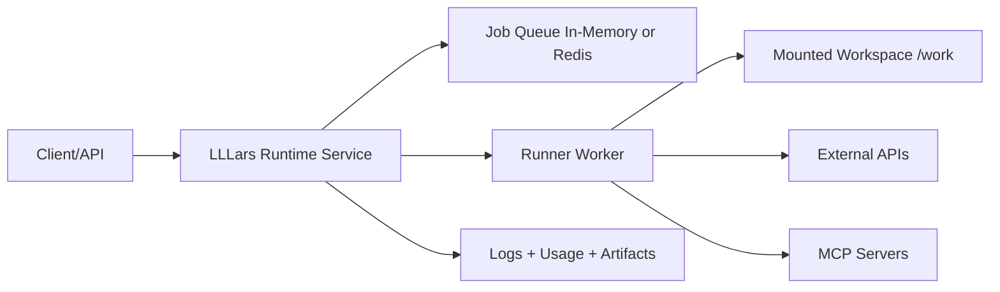

# Runtime Vision and Roadmap

## Runtime Vision
Operate as a runtime service that can run in containers on target systems,
operate on mounted volumes, and interact with external APIs/tools under policy
constraints.

## Roadmap Phases

### Phase 1: Runtime Contract
- Define JobSpec and RunResult schemas.
- Include prompt, project root, command profile, usage limits, timeout, env
  allowlist, artifact paths.
- Status: complete.

### Phase 2: Daemon Mode
- Add service mode alongside one-shot CLI.
- Expose minimal operational endpoints: health, submit, status, logs, cancel.
- Status: complete.

### Phase 3: Container Filesystem Model
- Standardize mounts:
  - /work (rw)
  - /config (ro)
  - /artifacts (rw)
- Enforce project-root confinement under /work.
- Status: complete for current runtime deployment assets.

### Phase 4: Execution Hardening
- Move to named command profiles.
- Add env pass-through allowlist.
- Redact secrets in logs/artifacts.
- Support optional no-network mode.
- Status: partial; command profile and policy baseline are active, advanced
  hardening remains open.

### Phase 5: Packaging and Startup UX
- Runtime image with non-root execution and healthcheck.
- Support run-once and daemon startup.
- Provide practical deployment examples.
- Status: complete for current Docker runtime path.

### Phase 6: Observability and Operability
- Structured per-job logs.
- Persist job artifacts and telemetry timelines.
- Startup preflight summary for endpoint, MCP, and mounts.
- Status: complete for current single-service runtime.

### Phase 7: Scaling Path
- Optional Redis-backed queue.
- Stateless API and worker split.
- Horizontal worker scaling and optional auth.
- Status: planned; not baseline behavior.

## MVP Slice (Shipped)
- Single runtime service container.
- Mounted project volume support.
- HTTP submit/status/cancel.
- Existing guardrails preserved:
  - usage limits
  - retries
  - allowlisted shell commands
  - MCP preflight
- Per-job artifacts for post-mortem analysis.
